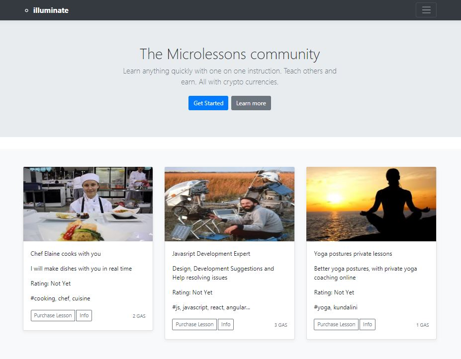

  

<h1 align="center">illuminate-nos</h1>

  illuminate is microlearning distributed application built on the the <strong>nOS</strong> platform.

## Purpose
illuminate is "the Microlessons community". Learn anything quickly with one on one instruction. Teach others and earn. All with crypto currencies.

## Roadmap

0.3 - August 2018
- nOS dapp POC
- neoGAS purchases of Microlessons
- modal video dialog sample (current nOS browser does not support userMedia)

0.4 - September 2018
- basic menuing and routing
- purchases and ratings on the block
- register as a provider
- live text based interactions

0.5
- register lesson providers
- lesson categories
- implementation/integration of nOS browser getUserMedia
- video stream based lessons

0.6
- scaling solution for ipfs-block data granularity/referencing problem
- share your screen in lessons
- video lesson refinements

0.7 / 0.8 / 0.9
- video record (with mutual agreement) for later playback
- escrow and commissions
- recommended categories for you
- my lessons
- see previously recorded (at a discount)
